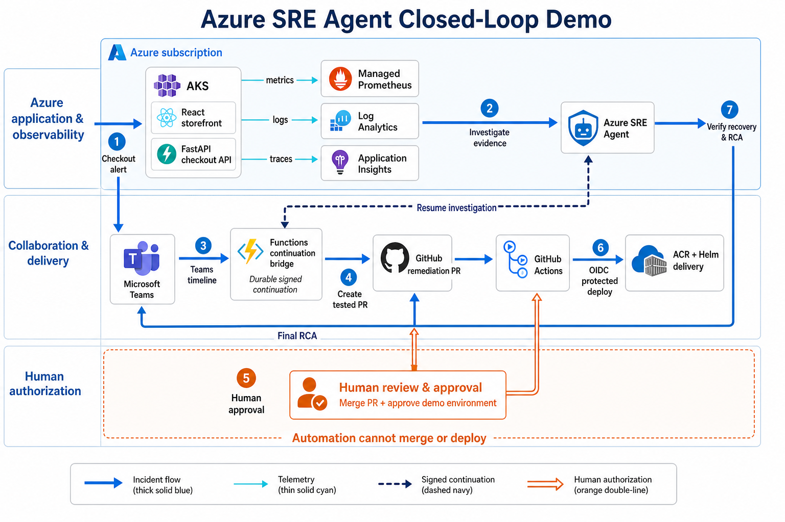

# Azure SRE Agent Closed-Loop Demo

This repository will demonstrate a complete, human-governed incident response flow for a storefront running on Azure Kubernetes Service (AKS):

```text
Azure Monitor alert
  -> Azure SRE Agent investigation and Teams timeline
  -> GitHub fix pull request
  -> human review
  -> GitHub Actions deployment
  -> Azure SRE Agent verification
  -> Teams and GitHub root-cause analysis
```

The application will contain a React storefront and a Python FastAPI checkout service. Azure Monitor managed service for Prometheus, Log Analytics, Application Insights, and Azure Managed Grafana will provide complementary metrics, runtime evidence, traces, and visualization.

## Architecture and Project Flow



The project closes an incident from detection through verified recovery while preserving a mandatory human authorization boundary:

1. **Detect:** the deterministic checkout regression raises the bounded failure-ratio metric and fires the Azure Monitor alert.
2. **Investigate:** Azure SRE Agent correlates Managed Prometheus metrics, Log Analytics records, Application Insights traces, AKS health, release metadata, and deployed source.
3. **Communicate:** the agent starts a Microsoft Teams incident thread and posts material evidence updates through the Functions continuation bridge.
4. **Propose:** the constrained remediation skill creates a branch, adds a regression test, applies the minimum fix, and opens a GitHub pull request.
5. **Authorize:** a person reviews and merges the SRE remediation pull request. The validated merge automatically authorizes deployment to the main-only `demo` environment.
6. **Deploy:** GitHub Actions exchanges an environment-bound OIDC token for short-lived Azure access, publishes immutable image digests, and deploys them to AKS with Helm.
7. **Verify and close:** signed GitHub events resume the original investigation. The agent verifies the deployed SHA and digest, ready replicas, successful `FIELD20` checkout, signal recovery, and alert resolution before posting the final RCA to Teams and GitHub.

> **Human authorization boundary:** Azure SRE Agent can investigate and prepare a tested pull request, but it has no merge, review, workflow-dispatch, deployment, or Azure-write tool.

## Current Status

Stages 1-18 are complete. Stage 17 proved the live alert, SRE investigation, Teams timeline, automatic remediation PR, rejection, reopen, user merge, protected recovery deployment, alert resolution, and final RCA. Merge, review, workflow dispatch, and deployment tools remain unavailable to the agent. The application is healthy on the FIELD20 fix with traffic disabled. See the [Stage 17 rehearsal record](docs/stages/17-approval-rejection-rehearsal.md) and the user-owned Stage 18 [architecture proposal](docs/architecture/sre-agent-demo-architecture.html).

## Quick Start: Run the Demo from Your Fork

> **First time? Start here.** Each presenter must use their own fork, Azure subscription, local Terraform state, GitHub environment, webhook, and Teams destination. Do not deploy from the canonical repository unless you are its maintainer. The expanded explanations and troubleshooting steps are in [Run the demo from your own fork](docs/colleague-setup.md).

### 1. Fork, clone, and authenticate

Fork `msftse/sre-agent-demo` in GitHub, then clone **your fork**:

```bash
git clone https://github.com/<your-github-owner>/sre-agent-demo.git
cd sre-agent-demo
git remote add upstream https://github.com/msftse/sre-agent-demo.git

az login
az account set --subscription <your-subscription-id-or-name>
gh auth login
gh auth status
```

Required local tools are Azure CLI, GitHub CLI, Terraform, Docker, `jq`, `kubectl`, `kubelogin`, Helm, Node.js/npm, `uv`, Azure Functions Core Tools, OpenSSL, and ShellCheck. You need Owner access on the Azure subscription and Admin access on your fork. Review the [pricing guide](azure-sre-agent/pricing/azure-sre-agent-pricing.md) before provisioning.

On macOS with Homebrew, install the CLI prerequisites with:

```bash
brew tap hashicorp/tap
brew tap azure/functions
brew tap Azure/kubelogin
brew install azure-cli gh hashicorp/tap/terraform jq kubernetes-cli Azure/kubelogin/kubelogin helm node uv shellcheck
brew install azure/functions/azure-functions-core-tools@4
brew install --cask docker
```

If Homebrew asks you to trust a vendor tap, review the prompt and follow your organization’s package policy. Start Docker Desktop before running preflight. Git, OpenSSL, `curl`, and `zip` are included with macOS developer tools; install them separately if your environment does not provide them.

### 2. Collect your Teams values

You need:

- Teams tenant ID (GUID). This can differ from the Azure subscription tenant.
- Team ID (GUID).
- Channel ID in `19:...@thread.tacv2` format.
- Your Teams/Entra user object ID (GUID).

See [Teams identity inputs](docs/colleague-setup.md#teams-identity-inputs) for step-by-step Teams UI and Microsoft Graph discovery commands, including the separate-tenant login and Azure-context restore sequence.

### 3. Generate your local deployment profile

Run from the repository root:

```bash
./scripts/setup-colleague.sh \
  --teams-tenant-id <teams-tenant-guid> \
  --teams-team-id <team-guid> \
  --teams-channel-id '<channel-id-19-thread-tacv2>' \
  --teams-user-object-id <your-user-object-guid> \
  --owner-email <owner@example.com>
```

The script discovers the active Azure subscription/tenant and GitHub fork, then creates `.demo-profile.env` and `iac/terraform.tfvars` with mode `0600`. Both files are ignored by Git and contain no PAT, bot secret, webhook secret, or MCP key. Use `--name-suffix <4-8-lowercase-alnum>` when you need deterministic Azure names.

This topology supports exactly one active Azure deployment per fork and requires a unique Teams channel per colleague. The GitHub environment is fixed to `demo` because the delivery workflow, OIDC trust, webhook, and repository secrets form one repository-wide control plane. Use another fork for a second simultaneous deployment.

### 4. Run mandatory preflight checks

```bash
./scripts/preflight.sh
./scripts/verify-terraform.sh
```

`preflight.sh` invokes the profile verifier after confirming the required tools exist. Do not continue until both commands pass.

### 5. Provision the isolated Azure environment

```bash
terraform -chdir=iac init
terraform -chdir=iac validate
terraform -chdir=iac plan -out=colleague.tfplan
terraform -chdir=iac apply colleague.tfplan
```

Terraform state and the saved plan are local and ignored. Never commit or share `.demo-profile.env`, `iac/terraform.tfvars`, `*.tfstate*`, or `*.tfplan`.

The apply can take 20–40 minutes, with AKS, Managed Grafana, Azure SRE Agent, and Functions usually accounting for most of the wait. After apply, verify that the SRE Agent control plane and data plane are ready:

```bash
SRE_AGENT=$(terraform -chdir=iac output -json sre_agent)
SRE_AGENT_ID=$(jq -r '.id' <<<"$SRE_AGENT")
SRE_AGENT_ENDPOINT=$(jq -r '.endpoint' <<<"$SRE_AGENT")

az resource show \
  --ids "$SRE_AGENT_ID" \
  --api-version 2026-01-01 \
  --query properties.provisioningState \
  -o tsv

SRE_TOKEN=$(az account get-access-token \
  --resource https://azuresre.dev \
  --query accessToken \
  -o tsv)
curl --fail --silent --show-error \
  --header "Authorization: Bearer $SRE_TOKEN" \
  "${SRE_AGENT_ENDPOINT%/}/api/v1/threads" \
  | jq 'length'
unset SRE_TOKEN
```

Continue only when the provisioning state is `Succeeded` and the data-plane request returns JSON.

### 6. Configure the fork's GitHub environment

In the fork, open **Settings > Actions > General**, enable Actions, select **Read repository contents permission** under Workflow permissions, and leave **Allow GitHub Actions to create and approve pull requests** disabled. Then run:

```bash
./scripts/configure-github-environment.sh
```

This creates the Terraform-selected GitHub environment (default `demo`) and writes its eight deployment variables plus the `APPLICATIONINSIGHTS_CONNECTION_STRING` environment secret.

Create a fine-grained PAT scoped only to your fork with:

- Contents: read/write
- Actions: read/write
- Pull requests: read
- Administration: read/write

Store it as the **repository-level Actions secret** `STAGE17_GITHUB_TOKEN` under **Settings > Secrets and variables > Actions**. Never put the token in a local file. Verify the environment and secret metadata:

```bash
./scripts/verify-github-environment.sh
```

### 7. Create the Teams bridge secrets and deploy the bridge

```bash
SUBSCRIPTION_ID=$(terraform -chdir=iac output -raw subscription_id)
TEAMS_BRIDGE=$(terraform -chdir=iac output -json teams_bridge)
BOT_APP_ID=$(jq -r '.bot_client_id' <<<"$TEAMS_BRIDGE")
KEY_VAULT=$(jq -r '.key_vault_name' <<<"$TEAMS_BRIDGE")

./scripts/provision-teams-bot-identity.sh store-secrets \
  --subscription "$SUBSCRIPTION_ID" \
  --app-id "$BOT_APP_ID" \
  --key-vault "$KEY_VAULT"

./scripts/deploy-teams-bridge.sh
```

Deployment publishes the Function, packages the Teams app, configures the Teams and GitHub connectors, installs the checkout skill/responder/response plan, and registers the signed GitHub continuation webhook. Sideload `.teams-package/azure-sre-agent.zip` into the Team/channel selected in step 3.

In Teams, open **Apps > Manage your apps > Upload an app > Upload a custom app**, select `.teams-package/azure-sre-agent.zip`, choose **Add to a team**, and select the configured Team. In the configured channel, mention the bot with `@Azure SRE Agent status`. It should reply that the bridge is ready. If custom-app upload is unavailable, ask the Teams administrator to allow or upload the app for that tenant.

### 8. Verify the deployed control plane

```bash
./scripts/verify-teams-bridge.sh
./scripts/verify-github-connector.sh
./scripts/verify-checkout-skill.sh
./scripts/verify-checkout-response-plan.sh
./scripts/verify-github-continuation.sh
./scripts/configure-github-protection.sh incident-demo
```

### 9. Deploy the healthy baseline

The protected workflow builds, scans, publishes, and deploys the application, so a separate local image push is not required for the normal colleague path:

```bash
BASELINE_SHA=$(git rev-parse origin/main)
REPOSITORY=$(terraform -chdir=iac output -raw github_repository)
gh workflow run deliver-demo.yml \
  --repo "$REPOSITORY" \
  --ref main \
  -f deploy=true \
  -f deploy_sha="$BASELINE_SHA" \
  -f incident_traffic=false

RUN_ID=$(gh run list \
  --repo "$REPOSITORY" \
  --workflow deliver-demo.yml \
  --event workflow_dispatch \
  --commit "$BASELINE_SHA" \
  --limit 1 \
  --json databaseId \
  --jq '.[0].databaseId')
[[ -n "$RUN_ID" ]] || {
  printf '%s\n' 'The workflow run is not visible yet; rerun the RUN_ID command.' >&2
  exit 1
}
gh run watch "$RUN_ID" --repo "$REPOSITORY" --exit-status
```

Confirm the workflow succeeds, then connect to AKS and verify the healthy baseline:

```bash
RESOURCE_GROUP=$(terraform -chdir=iac output -raw resource_group_name)
AKS_NAME=$(terraform -chdir=iac output -raw aks_name)
az aks get-credentials \
  --resource-group "$RESOURCE_GROUP" \
  --name "$AKS_NAME" \
  --overwrite-existing
kubelogin convert-kubeconfig -l azurecli
kubectl get deployments --namespace northstar
helm status northstar --namespace northstar
```

### 10. Run the customer demo

Before the customer joins, confirm:

- The healthy baseline workflow succeeded.
- Backend and frontend show `2/2` ready replicas.
- No traffic-generator deployment exists.
- `@Azure SRE Agent status` succeeds in the configured Teams channel.
- All five control-plane verifiers from step 8 pass.
- PRs and delivery workflows are idle.
- Branch protection is `incident-demo`.

During the demo:

1. In your fork, open **Actions > Start Demo > Run workflow**.
2. Enable **Confirm direct publication of the intentional FIELD20 regression to main**. If it remains false, the job is skipped by design.
3. `Start Demo` validates and pushes the incident commit, then deploys it with deterministic traffic. Initial delivery commonly takes several minutes.
4. Azure Monitor evaluates every minute and requires two failing windows. Allow roughly 2–5 minutes after traffic starts for the alert and SRE investigation to appear.
5. Watch the configured Teams channel for **Investigation started**, then follow evidence and root-cause updates.
6. Azure SRE Agent opens the only PR in the flow. Review the code and required check. Reject/reopen it if demonstrating governance, or merge it when ready. The agent cannot merge or deploy.
7. Merge starts `Deliver Demo to AKS` automatically; there is no separate environment-review approval in this demo. Recovery commonly takes several minutes.
8. Confirm the new merge SHA is deployed, backend/frontend return to `2/2`, FIELD20 succeeds, and the traffic-generator deployment is absent.
9. Alert auto-resolution is configured for five clean minutes, so the final RCA can arrive several minutes after deployment succeeds.
10. Show the same canonical RCA in the remediation PR comments and the existing Teams incident thread.

For a repeat customer demo, no state reset or table cleanup is required after a successful recovery. Wait until the alert is resolved, no PR is open, delivery is idle, and the prior RCA is complete; then run **Start Demo** again. It discovers the latest fork-local remediation, or the inherited remediation on the first run in a fresh fork.

If a checkpoint stalls:

| Symptom | First check |
| --- | --- |
| Baseline or recovery workflow fails before Azure login | `./scripts/verify-github-environment.sh` and the workflow job log |
| Teams bot does not answer `status` | `./scripts/verify-teams-bridge.sh`, then confirm the exact tenant, Team, channel, and allowed user |
| Alert does not fire | Confirm `northstar-sre-demo-traffic` is ready and review `NorthstarCheckoutFailureRatioHigh` in Azure Monitor |
| No remediation PR appears | Run the response-plan and GitHub connector verifiers; inspect the newest SRE thread |
| Merge succeeds but recovery does not start | Check `Deliver Demo to AKS`, webhook delivery, and `./scripts/verify-github-continuation.sh` |
| Deployment succeeds but RCA is deferred | Wait for the five-minute alert recovery window and confirm post-deployment checkout requests are HTTP 200 |

### 11. Tear down after the customer session

```bash
RESOURCE_GROUP=$(terraform -chdir=iac output -raw resource_group_name)
terraform -chdir=iac destroy
az group exists --name "$RESOURCE_GROUP"
```

Deletion is important: stopping Azure SRE Agent stops active-flow work but does not stop its always-on charge. If destroy reports an Azure asynchronous-delete or subnet-in-use error, wait for platform cleanup and rerun the same command; never remove resources from Terraform state merely to hide the error.

The final command must return `false`. If it returns `true`, rerun `terraform destroy` after Azure finishes asynchronous cleanup.

Remove the custom Teams app from the Team if it is no longer needed, revoke the fine-grained PAT, and delete or disable the fork’s repository secrets. See [pricing and cost management](azure-sre-agent/pricing/azure-sre-agent-pricing.md) and the complete [fork lifecycle guide](docs/colleague-setup.md).

## Optional Local Development

The cloud demo does not require running the application locally. For local changes, install and validate the backend and frontend:

```bash
cd src/backend
uv sync --locked --all-groups
uv run ruff check .
uv run mypy app tests
uv run pytest

cd ../frontend
npm ci
npm test
npm run lint
npm run build
```

The backend uses Python 3.12 provisioned by `uv`. npm and Python dependencies resolve through the Microsoft package-feed proxies committed in each project.

## Project Structure

```text
.
├── .github/
│   ├── pull_request_template.md
│   └── workflows/
│       ├── deliver-demo.yml
│       └── start-demo.yml
├── .editorconfig
├── .gitignore
├── AGENT.md
├── CHANGELOG.md
├── README.md
├── docs/
│   ├── colleague-setup.md
│   └── stages/
│       ├── 01-preflight.md
│       ├── 02-application.md
│       ├── 03-local-review.md
│       ├── 04-observability.md
│       ├── 05-containers-helm.md
│       ├── 06-terraform-foundation.md
│       ├── 07-core-azure-aks.md
│       ├── 08-managed-observability.md
│       ├── 09-protected-github-delivery.md
│       ├── 10-checkout-incident.md
│       ├── 11-sre-agent-foundation.md
│       ├── 12-teams-bridge.md
│       ├── 13-github-connector.md
│       ├── 14-checkout-skill.md
│       ├── 15-incident-response-plan.md
│       ├── 16-continuation-loop.md
│       ├── 17-approval-rejection-rehearsal.md
│       ├── 18-architecture-proposal.md
│       └── README.md
├── deploy/
│   └── helm/
│       └── sre-demo/
│           ├── templates/
│           ├── Chart.yaml
│           ├── values.schema.json
│           └── values.yaml
├── iac/
│   ├── modules/
│   │   ├── aks/
│   │   ├── aks-monitoring/
│   │   ├── container-registry/
│   │   ├── identities/
│   │   ├── network/
│   │   ├── observability/
│   │   ├── resource-group/
│   │   ├── sre-agent/
│   │   └── teams-bridge/
│   ├── .terraform.lock.hcl
│   ├── main.tf
│   ├── outputs.tf
│   ├── providers.tf
│   ├── terraform.tfvars.example
│   └── variables.tf
├── scripts/
│   ├── audit-tags.sh
│   ├── configure-github-environment.sh
│   ├── configure-github-webhook.sh
│   ├── configure-sre-agent-capabilities.sh
│   ├── configure-sre-checkout-responder.sh
│   ├── configure-sre-checkout-response-plan.sh
│   ├── configure-sre-checkout-skill.sh
│   ├── configure-sre-github-connector.sh
│   ├── configure-sre-teams-connector.sh
│   ├── configure-github-protection.sh
│   ├── deploy-teams-bridge.sh
│   ├── package-teams-app.sh
│   ├── preflight.sh
│   ├── provision-teams-bot-identity.sh
│   ├── publish-images.sh
│   ├── render-teams-icons.py
│   ├── setup-colleague.sh
│   ├── verify-checkout-skill.sh
│   ├── verify-checkout-response-plan.sh
│   ├── verify-colleague-profile.sh
│   ├── verify-deployment.sh
│   ├── verify-github-environment.sh
│   ├── verify-github-connector.sh
│   ├── verify-github-continuation.sh
│   ├── verify-teams-bridge.sh
│   ├── verify-terraform.sh
│   ├── verify-containers.sh
│   ├── verify-observability.sh
│   └── lib/
│       └── repository.sh
├── azure-sre-agent/
│   ├── pricing/
│   │   └── azure-sre-agent-pricing.md
│   ├── response-templates/
│   │   └── northstar-checkout-rca.md
│   ├── skills/
│   │   └── northstar-checkout-remediation.md
│   └── subagents/
│       └── sre-agent-responders/
│           └── northstar-checkout-responder.md
└── src/
    ├── backend/
    │   ├── app/
    │   │   ├── catalog.py
    │   │   ├── config.py
    │   │   ├── main.py
    │   │   ├── models.py
    │   │   ├── observability.py
    │   │   └── service.py
    │   ├── tests/
    │   │   ├── test_api.py
    │   │   └── test_observability.py
    │   ├── .dockerignore
    │   ├── Dockerfile
    │   ├── pip.conf
    │   ├── pyproject.toml
    │   └── uv.lock
    ├── frontend/
        ├── public/
        │   └── products/
        │       ├── alpine-shell.jpg
        │       ├── field-pack.jpg
        │       ├── ridge-lamp.jpg
        │       └── trail-flask.jpg
        ├── src/
        │   ├── test/
        │   ├── App.css
        │   ├── App.test.tsx
        │   ├── App.tsx
        │   ├── api.ts
        │   ├── index.css
        │   ├── main.tsx
        │   └── types.ts
        ├── .dockerignore
        ├── .npmrc
        ├── Dockerfile
        ├── nginx.conf
        ├── package-lock.json
        ├── package.json
        └── vite.config.ts
      └── teams-bridge/
        ├── appPackage/
        ├── bridge/
        ├── tests/
        ├── function_app.py
        ├── host.json
        ├── pyproject.toml
        ├── requirements.txt
        └── uv.lock
```

## Delivery Approach

The demo is built one stage at a time. Each stage starts with an explanation of its purpose and expected changes, and ends with validation, documentation, review, and a scoped commit.

See [docs/stages/README.md](docs/stages/README.md) for the stage map and progress.

Application code is grouped under `src/`: the Python API lives in `src/backend`, and the React application lives in `src/frontend`.

## Healthy Application

The FastAPI service exposes health probes, a server-priced product catalogue, discount validation, and checkout. The storefront consumes that contract to provide catalogue loading, quantity controls, discount feedback, computed totals, checkout, confirmation, and explicit loading/error states. All data is synthetic and no payment or personal data is persisted.

## Local Observability

The backend exposes Prometheus metrics at `/metrics` and release metadata at `/api/release`. Every application response includes `X-Operation-ID`, `X-Trace-ID`, and `X-Build-SHA`. JSON request/error logs and OpenTelemetry request/checkout spans carry those same identifiers so an investigation can move between a metric, a log, a trace, and the responsible Git commit.

Set release identity through these environment variables:

| Variable | Local default | Purpose |
| --- | --- | --- |
| `SRE_DEMO_SERVICE_VERSION` | `0.1.0` | Application version |
| `SRE_DEMO_GIT_SHA` | `development` | Source commit deployed |
| `SRE_DEMO_IMAGE_DIGEST` | `local` | Immutable container identity when available |
| `SRE_DEMO_INSTANCE_ID` | Hostname | Process/pod identity |
| `SRE_DEMO_TRACE_CONSOLE_EXPORTER` | `false` | Print spans locally for learning and verification |
| `VITE_GIT_SHA` | `development` | Frontend build marker |

See [docs/stages/04-observability.md](docs/stages/04-observability.md) for signal definitions and sample queries.

## Containers and Helm

The backend runtime uses Python 3.12 as UID/GID `10001`; the frontend runtime uses unprivileged Nginx as UID/GID `101`. Both support read-only root filesystems, drop all Linux capabilities, expose health checks, and carry OCI version/revision/source labels. Production frontend requests use same-origin paths and Nginx proxies API, health, and metrics traffic to the stable `backend` Kubernetes Service.

The Helm chart defaults to two replicas per service, Restricted Pod Security, no service-account token mounts, explicit requests/limits/probes, component NetworkPolicies, PDBs, and an Azure Managed Prometheus `ServiceMonitor`. Production deployments should set ACR image digests rather than relying on tags.

See [docs/stages/05-containers-helm.md](docs/stages/05-containers-helm.md) for chart values and validation details.

## Terraform Foundation

All Terraform files live under `iac/`. State is local and ignored; there is intentionally no `backend.tf`. AzureRM automatic provider registration is disabled, and required subscription-wide providers are validated as pre-existing prerequisites rather than adopted into this environment's state. Azure subscription and tenant IDs are supplied only through `TF_VAR_*` or an ignored `terraform.tfvars` file.

Core planning covers the resource group, VNet/subnet/NSG/public IP, Standard ACR, Cilium AKS, GitHub Actions managed identity/OIDC, and RBAC. The deployed environment also enables managed observability and Azure SRE Agent.

Every taggable Terraform resource receives `SecurityControl=Ignore`. The verifier runs format/init/validate, Checkov, core and full no-apply plans, and plan JSON tag audits. See [docs/stages/06-terraform-foundation.md](docs/stages/06-terraform-foundation.md).

## Core Azure and AKS

Each deployment receives a generated suffix exposed by `terraform -chdir=iac output -raw resource_name_suffix`. AKS runs two `Standard_D2ds_v5` Azure Linux 3 nodes with host encryption, managed Entra authentication, Azure RBAC, OIDC/workload identity, and Cilium. The local operator role is opt-in and cluster-scoped; reusable Terraform configurations create no human data-plane assignment by default.

The backend and frontend are built locally for AMD64, pushed to the ACR endpoint returned by `terraform -chdir=iac output -raw acr_login_server`, and deployed by digest. Helm release `northstar` runs two replicas of each component in a Restricted namespace with PDBs and NetworkPolicies. Its in-cluster smoke test verifies backend readiness and frontend health.

Connect to the cluster and review the application locally:

```bash
RESOURCE_GROUP=$(terraform -chdir=iac output -raw resource_group_name)
AKS_NAME=$(terraform -chdir=iac output -raw aks_name)
az aks get-credentials \
  --resource-group "$RESOURCE_GROUP" \
  --name "$AKS_NAME" \
  --overwrite-existing
kubelogin convert-kubeconfig -l azurecli
kubectl port-forward --namespace northstar \
  service/northstar-sre-demo-frontend 8080:8080
```

Open `http://127.0.0.1:8080/`. See [docs/stages/07-core-azure-aks.md](docs/stages/07-core-azure-aks.md).

## Managed Azure Observability

AKS sends managed Prometheus metrics and cost-scoped Northstar container logs to the resources identified by the nested `observability` Terraform output. Selected API server, privileged audit, and authentication logs use resource-specific Log Analytics tables. Managed Grafana is linked to the Azure Monitor workspace.

The backend sends its existing OpenTelemetry server and checkout spans to the Application Insights component identified by that output. AKS workload identity authenticates ingestion with no client secret; the identity receives only `Monitoring Metrics Publisher` on the component, whose local authentication is disabled.

Useful queries:

```promql
northstar_build_info
sum by (outcome) (northstar_checkout_attempts_total)
```

```kusto
ContainerLogV2
| where PodNamespace == "northstar"
| extend Payload = parse_json(LogMessage)
| project TimeGenerated,
          OperationId=tostring(Payload.operation_id),
          TraceId=tostring(Payload.trace_id),
          StatusCode=toint(Payload.status_code)
| order by TimeGenerated desc
```

Get the current Managed Grafana endpoint with:

```bash
terraform -chdir=iac output -json observability | jq -r '.grafana_endpoint'
```

See [docs/stages/08-managed-observability.md](docs/stages/08-managed-observability.md) for resource names, signal queries, security boundaries, and validation evidence.

## Protected GitHub Delivery

Pull requests to `main` run backend, frontend, and Helm validation. The repository has two protection profiles: `routine` permits direct setup-stage commits while retaining linear-history/no-force-push safeguards; `incident-demo` requires a successful validation check, resolved conversations, and linear history. The SRE Agent cannot merge, review, or mutate its remediation pull request.

The manually dispatched `Start Demo` workflow discovers the latest merged `sre/field20-checkout-*` remediation, inverts that remediation into one intentional regression commit, validates the backend, and publishes the commit directly to `main`. It temporarily applies the existing `routine` protection profile only for that push and restores `incident-demo` protection even on failure. It then dispatches `Deliver Demo to AKS` with the exact commit SHA and deterministic traffic enabled. Azure Monitor fires the checkout alert and Azure SRE Agent investigates, updates Teams, and creates the only PR in the flow: a new `sre/field20-checkout-*` remediation. You review and merge that remediation PR; `Deliver Demo to AKS` starts recovery automatically with traffic disabled. The `demo` environment has no reviewer gate but accepts only `main`, preserving environment-bound OIDC and branch restriction. Recovery deploys the remediation merge SHA, verifies FIELD20 and telemetry, allows the alert to resolve, and resumes the SRE Agent for final Teams and PR RCA. The job authenticates to Azure through the repository's immutable environment-bound OIDC subject, builds AMD64 images on the GitHub-hosted Docker daemon, pushes with Docker, rejects fixed critical vulnerabilities, creates SPDX SBOMs, and deploys only registry digests. `scripts/verify-deployment.sh` proves the release SHA, digests, replicas, workload identity, ServiceMonitor, and in-cluster health.

Repository secret `STAGE17_GITHUB_TOKEN` supplies the operator-scoped credential needed to switch protection profiles, push the validated incident commit to `main`, and dispatch delivery. Prefer a fine-grained token or GitHub App limited to this repository with contents, Actions, and administration permissions.

The Stage 9 validation first proved that a critical frontend OpenSSL CVE blocks deployment, then proved that the patched replacement can complete end to end. See the Stage 9 record for its historical run evidence.

Enable the approval boundary before the SRE Agent incident exercise:

```bash
./scripts/configure-github-protection.sh incident-demo
```

See [docs/stages/09-protected-github-delivery.md](docs/stages/09-protected-github-delivery.md) for merge controls, workflow steps, OIDC trust, CVE evidence, and deployed digests.

## Deterministic Checkout Incident

The prepared regression affects only valid `FIELD20` checkout: discount validation succeeds, but checkout returns HTTP 500 with error code `discount_calculation_failed`. Health endpoints and ordinary checkout remain green, and the existing suite intentionally lacks the valid FIELD20 checkout case that the later SRE Agent fix must add.

The disabled traffic generator submits a qualifying FIELD20 request every five seconds and continues after failures. Azure Monitor evaluates the checkout 5xx ratio every minute, requires more than 50% failures plus active traffic across two minutes, and auto-resolves after recovery. Azure SRE Agent discovers the alert through its native subscription scanner; no action group is required.

The incident is not active. Start it in GitHub under **Actions > Start Demo > Run workflow**, select **Confirm direct publication**, and run it. The starter validates and publishes the incident commit directly to `main`, then dispatches incident delivery. After Azure SRE Agent creates the remediation PR, review and merge that PR. `Deliver Demo to AKS` automatically restores the application and the agent publishes the final RCA. See [docs/stages/17-approval-rejection-rehearsal.md](docs/stages/17-approval-rejection-rehearsal.md).

## Azure SRE Agent Foundation

The Azure SRE Agent identified by the nested `sre_agent` Terraform output runs on the Stable channel with native Azure Monitor incident management. Its log configuration sends incident traces and agent audit telemetry to the managed Application Insights component. Global `Review` mode and Low access provide a conservative Azure-action fallback. A dedicated UAMI has the documented monitoring/read roles for the demo resource group and AKS cluster; it has no general Azure contributor or AKS administrator role.

Retrieve the current endpoint with `terraform -chdir=iac output -json sre_agent | jq -r '.endpoint'`. Stage 14 added the reusable checkout skill, and Stage 15 set Autonomous mode only on the exact Sev1 checkout response plan. GitHub permissions and branch protection allow branch/commit/PR creation while preventing merge or deployment. The completed Stage 18 architecture proposal documents the deployed design, and Stage 17 proved those rehearsal boundaries live.

See [docs/stages/11-sre-agent-foundation.md](docs/stages/11-sre-agent-foundation.md) for identity wiring, RBAC scopes, native alert discovery, and validation evidence.

## Teams Bridge

Stage 12 runs a Python 3.12 Azure Functions Flex Consumption bridge behind Azure Bot Service. Inbound Teams activities are restricted to the approved tenant, Team, `IJ-Test` channel, and operator. Outbound SRE updates use three authenticated MCP tools for a root notification, threaded replies, and route lookup; no tool can select another destination or perform Azure/GitHub changes. For autonomous alerts, the bridge resolves the Azure incident ID to exactly one canonical SRE chat thread and returns that ID for durable PR continuation markers.

Deploying the bridge also runs `scripts/configure-sre-agent-capabilities.sh`. This idempotently configures the Teams connector, GitHub connector, and checkout skill in dependency order, then verifies the live skill. The Teams script retrieves its custom-header key from Key Vault only at runtime, uses protected temporary files, and never prints the credential. Terraform state contains no bot, MCP, or GitHub credential.

Validate source and packaging with:

```bash
./scripts/verify-teams-bridge.sh
```

See [docs/stages/12-teams-bridge.md](docs/stages/12-teams-bridge.md) for the identity model, automation flow, permission boundary, deployment lessons, and live evidence.

## GitHub Connector

Stage 13 added the idempotent `northstar-github` connector through GitHub's official remote MCP server. Stage 16 extended its exact allowlist to `search_code`, `get_file_contents`, `pull_request_read`, `create_branch`, `push_files`, `create_pull_request`, and `add_issue_comment`. Merge, review, general PR mutation, workflow dispatch, and deployment tools are not visible to Azure SRE Agent.

The live gate verifies the connector metadata without printing its authorization header, confirms the forbidden tools remain absent, and rechecks GitHub's branch and protected-environment controls:

```bash
./scripts/verify-github-connector.sh
```

See [docs/stages/13-github-connector.md](docs/stages/13-github-connector.md) for the capability model, credential trade-off, idempotency proof, and live read validation.

## Checkout Remediation Skill

Stage 14 installs `northstar-checkout-remediation` as an Azure SRE Agent custom skill. Its source is under `azure-sre-agent/skills/`; it is deliberately outside `.github/skills` and cannot be discovered as a GitHub Copilot project skill.

The deployment script composes `azure-sre-agent/response-templates/northstar-checkout-rca.md` into the live skill content. Every completed incident RCA therefore uses the same headings and evidence fields in the GitHub PR comment and Microsoft Teams timeline. Unverified recoveries use the template's `Deferred` status instead of claiming resolution.

For the AAU billing model, fixed and variable cost formulas, model token rates, this environment's 10,000-AAU allocation, scenario estimates, spending controls, and optimization guidance, see [Azure SRE Agent pricing and cost management](azure-sre-agent/pricing/azure-sre-agent-pricing.md).

The skill resolves all Azure resource names and IDs from the active incident and live resource relationships, then correlates metrics, AKS health, logs, traces, release identity, and deployed source before proposing the FIELD20 repair. It can create a branch, commit, and PR, but must stop for human review.

Every Teams bridge deployment automatically runs the connector-and-skill bootstrap. Verify the live skill independently with:

```bash
./scripts/verify-checkout-skill.sh
```

See [docs/stages/14-checkout-skill.md](docs/stages/14-checkout-skill.md) for runtime discovery, tool scope, repair contract, deployment ordering, and live evidence.

## Incident Responder

Stage 15 deploys `northstar-checkout-responder` with no direct tools and only `northstar-checkout-remediation` in its allowed skill list. Its active Autonomous response plan matches only `Sev1` alerts whose title contains `NorthstarCheckoutFailureRatioHigh`. Alert merging is disabled so each demo run starts a distinct investigation and invokes the responder.

The responder must create a Teams incident root post before any source write and use the same thread for impact, root cause, PR handoff, failures, and final RCA. If Teams notification fails after one retry, branch/commit/PR creation is blocked.

Validate the live responder and plan with:

```bash
./scripts/verify-checkout-response-plan.sh
```

See [docs/stages/15-incident-response-plan.md](docs/stages/15-incident-response-plan.md) for filter scope, autonomy, timeline requirements, failure handling, and approval boundaries.

## GitHub Continuation Loop

Stage 16 adds a signed GitHub webhook at the Teams bridge. Pull-request, protected-deployment, and workflow-run events correlate through PR number and merge SHA to the original SRE thread and Teams root activity stored in Table Storage.

Public-repository callbacks are accepted only for same-repository `sre/field20-checkout-*` branches targeting `main`, the exact delivery workflow/environment, and exactly one hidden SRE thread marker. Delivery IDs and per-destination completion flags prevent duplicate Teams and SRE updates while allowing partial failures to resume safely.

The Function uses `github-webhook-secret` through a Key Vault reference. Deployment removes a classic empty `AzureWebJobsStorage` setting that Core Tools synthesizes during publish, preserving managed-identity storage authentication.

Validate the live callback boundary with:

```bash
./scripts/verify-github-continuation.sh
```

See [docs/stages/16-continuation-loop.md](docs/stages/16-continuation-loop.md) for event scope, durable correlation, retry behavior, continuation messages, deployment hardening, and live evidence.
